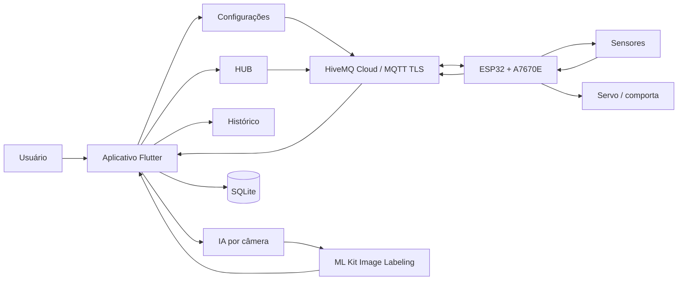
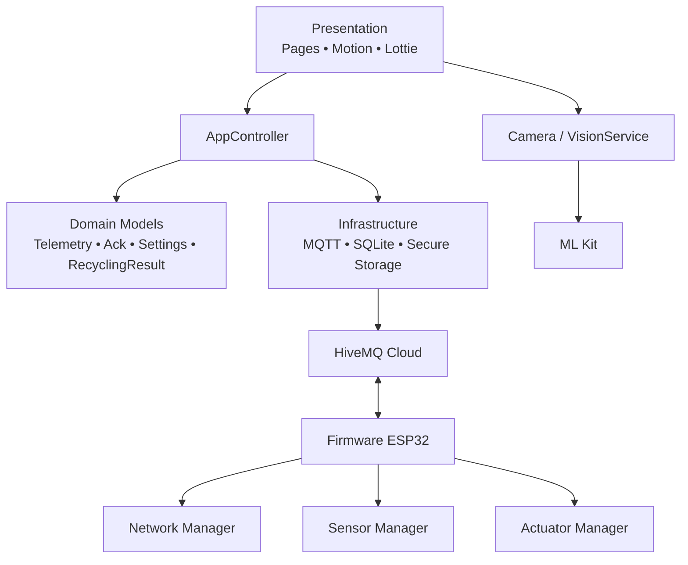
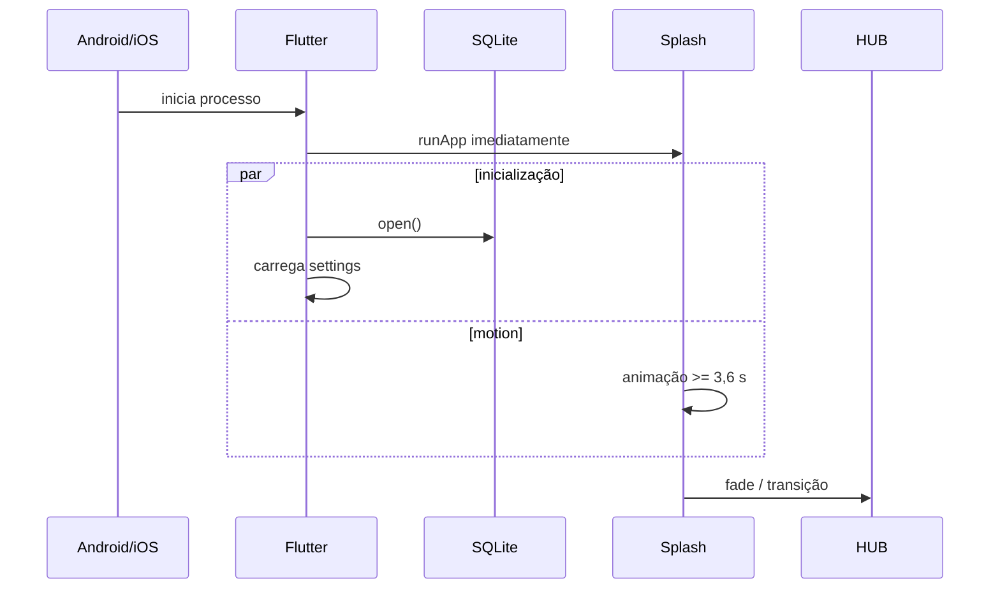
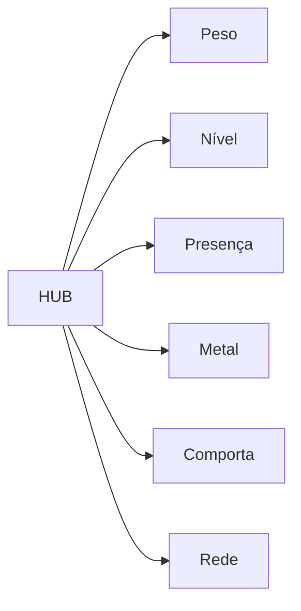
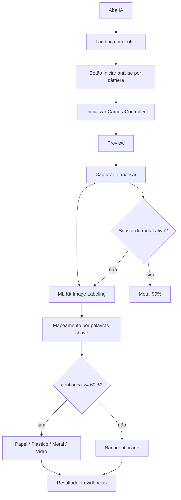
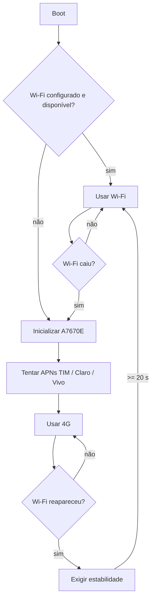

# Lixeira Inteligente 1.1.1+5 — Arquitetura e desenho completo da solução

> Documento técnico da implementação atual do projeto **Lixeira Inteligente**, composto por aplicativo Flutter/Dart e firmware para LilyGo TTGO T-Call A7670E.
>
> Base analisada: `Lixeira Inteligente 1.1.1+5` — Flutter 3.47+, Dart 3.12+, Android/iOS, ESP32 + A7670E, MQTT/HiveMQ TLS, SQLite, câmera + ML Kit e motion design.

## 1. Propósito do sistema

A Lixeira Inteligente é um sistema de coleta seletiva conectado que combina sensores físicos, conectividade IoT, aplicativo móvel e visão computacional para acompanhar o descarte de resíduos e auxiliar na identificação do material.

O conceito original do projeto prevê uma única abertura de descarte, identificação automática do resíduo e encaminhamento para o compartimento adequado. A implementação atual entrega a base funcional de monitoramento e controle: leitura de peso, presença, metal, nível, estado da comporta, conectividade Wi-Fi/4G, telemetria MQTT, controle remoto da comporta, histórico local e classificação visual de papel, plástico, metal, vidro ou estado não identificado.

O sistema é dividido em dois subsistemas:

- **ESP32/LilyGo T-Call A7670E** — aquisição de sensores, controle do servo, Wi-Fi, contingência 4G e MQTT/TLS;
- **Aplicativo Flutter** — HUB, telas de leitura, configuração HiveMQ, histórico, IA por câmera, SQLite e comandos remotos.

## 2. Visão geral do sistema



Fluxo resumido:

```text
USUÁRIO
   |
   v
APLICATIVO FLUTTER
   |
   +--> SPLASH / MOTION DESIGN
   |
   +--> HUB ----------------------+
   |                              |
   +--> IA / CÂMERA               |
   |                              v
   +--> HISTÓRICO            HIVEMQ CLOUD
   |                              ^
   +--> CONFIGURAÇÕES             |
                                  |
                         ESP32 + A7670E
                                  |
              +-------------------+-------------------+
              |                   |                   |
              v                   v                   v
           SENSORES            COMPORTA          WI-FI / 4G
```

## 3. Stack e dependências

### 3.1 Aplicativo

| Área | Tecnologia / pacote | Papel |
|---|---|---|
| UI | Flutter Material 3 | Interface Android/iOS |
| Linguagem | Dart | Regras, modelos, serviços e telas |
| MQTT | `mqtt_client` | HiveMQ, subscribe, publish e reconexão |
| Banco | `sqflite` | Telemetria, eventos e configurações não sensíveis |
| Segredos | `flutter_secure_storage` | Senha MQTT |
| Câmera | `camera` | Captura sob demanda |
| Visão | `google_mlkit_image_labeling` | Evidências visuais para classificação |
| Motion | Flutter animations + `lottie` | Splash, HUB, sensores, IA e feedback |
| IDs | `uuid` | `commandId` único para comandos MQTT |
| Caminhos | `path` | Local do banco SQLite |

Versão do `pubspec.yaml`: **1.1.1+5**.

### 3.2 Firmware

| Área | Tecnologia / biblioteca | Papel |
|---|---|---|
| Placa | LilyGo TTGO T-Call A7670E | Controlador principal + modem 4G |
| Framework | Arduino / PlatformIO | Firmware |
| Modem | TinyGSM fork LilyGo | A7670E, GPRS e MQTT TLS |
| MQTT Wi-Fi | PubSubClient | MQTT sobre `WiFiClientSecure` |
| JSON | ArduinoJson | Telemetria, comando e ACK |
| Peso | HX711 | Célula de carga |
| Atuador | ESP32Servo | Comporta |
| Rede | WiFi + A7670E | Wi-Fi prioritário e 4G de contingência |

## 4. Princípios de arquitetura

A solução usa uma organização modular por responsabilidades, inspirada em Clean Architecture e SOLID. O aplicativo separa modelos de domínio, persistência, MQTT, câmera/IA e apresentação. O firmware separa conectividade, MQTT, sensores e atuador.



Princípios aplicados:

- **Single Responsibility:** MQTT, banco, IA, conectividade, sensores e atuador possuem componentes separados.
- **Open/Closed:** a classificação visual fica isolada em `VisionService`, permitindo futura troca por TFLite/LiteRT.
- **Interface Segregation prática:** o aplicativo trabalha com modelos pequenos e serviços específicos.
- **Dependency Inversion conceitual:** a apresentação não implementa diretamente protocolo serial, modem ou persistência de baixo nível.
- **Fail-safe:** baixa confiança visual resulta em `Não identificado`, não em uma classificação forçada.

## 5. Estrutura de diretórios

```text
Lixeira_Inteligente/
├── ESP32/
│   ├── include/
│   │   ├── config.h
│   │   ├── config.example.h
│   │   ├── pins.h
│   │   ├── app_types.h
│   │   ├── connectivity.h
│   │   ├── mqtt_service.h
│   │   ├── sensors.h
│   │   ├── actuator.h
│   │   └── root_ca.h
│   ├── src/
│   │   ├── main.cpp
│   │   ├── connectivity.cpp
│   │   ├── mqtt_service.cpp
│   │   ├── sensors.cpp
│   │   └── actuator.cpp
│   ├── platformio.ini
│   ├── README.md
│   └── MQTT_PROTOCOL.md
└── Aplicativo/
    ├── lib/
    │   ├── main.dart
    │   ├── app_controller.dart
    │   ├── app_scope.dart
    │   ├── home_shell.dart
    │   ├── core/
    │   │   ├── database/
    │   │   ├── mqtt/
    │   │   ├── theme/
    │   │   └── ui/
    │   └── features/
    │       ├── splash/
    │       ├── dashboard/
    │       ├── sensors/
    │       ├── camera_ai/
    │       ├── history/
    │       ├── settings/
    │       ├── telemetry/
    │       └── actuator/
    ├── assets/
    │   ├── branding/
    │   └── lottie/
    ├── android/
    ├── ios/
    ├── tool/
    │   ├── bootstrap_windows.ps1
    │   ├── bootstrap_unix.sh
    │   └── configure_platforms.dart
    ├── test/
    ├── pubspec.yaml
    ├── QUICK_START.txt
    └── README.md
```

## 6. Inicialização e Splash

A inicialização foi desenhada para não exibir uma tela genérica do Flutter antes da identidade do produto.

1. `main()` chama `WidgetsFlutterBinding.ensureInitialized()`.
2. O `AppController` é criado.
3. `runApp()` é executado imediatamente.
4. A `SplashPage` aparece enquanto SQLite e configurações são inicializados.
5. A Splash permanece por no mínimo **3,6 segundos**.
6. O fundo usa gradiente animado, órbitas luminosas e Lottie local.
7. A saída usa `AnimatedOpacity`.
8. Android/iOS usam branding nativo alinhado ao primeiro frame da Splash.



## 7. Navegação principal

A barra inferior possui quatro destinos:

```text
[ HUB ]  [ Histórico ]  [ IA ]  [ Config. ]
```

`HomeShell` troca as áreas com `AnimatedSwitcher`. O item selecionado usa escala, cor e fundo animado.

## 8. HUB inicial

A Home funciona como **HUB de monitoramento**, não como tela de configuração.

O cabeçalho mostra:

- identidade `Lixeira Inteligente`;
- estado HiveMQ: conectado/offline;
- última rede reportada pelo ESP32 (`WIFI` ou `4G`);
- RSSI;
- estado aguardando telemetria quando ainda não há dados;
- animação Lottie local.

Cards atuais:

| Card | Origem | Exemplo |
|---|---|---|
| Peso | HX711 | `180 g` |
| Nível | sensor de distância | `64%` |
| Presença | sensor digital | `Objeto` / `Livre` |
| Metal | sensor indutivo | `Detectado` / `Não` |
| Comporta | firmware | `OPEN` / `CLOSED` |
| Rede | ESP32 | `WIFI` / `4G` |

Cada card usa `StaggeredReveal`, mudança de escala no toque, cor própria e transição para uma tela dedicada.

O HUB também gera um resumo simples:

- nível >= 85% -> alerta de capacidade crítica;
- metal detectado -> informa que essa evidência pode apoiar a IA;
- presença detectada -> sugere iniciar a classificação visual;
- sem alertas -> informa sistema estável.

## 9. Telas dedicadas de leitura



Cada tela dedicada contém:

- título e cor semântica;
- Lottie local;
- valor animado;
- descrição do sensor;
- estado interpretado;
- informações em tempo real;
- movimento de entrada.

Regras visuais:

- **Peso:** mostra gramas e estado `Objeto sobre a balança` ou `Aguardando objeto`.
- **Nível:** `Capacidade disponível`, `Atenção` ou `Capacidade crítica`.
- **Presença:** `Objeto detectado` ou `Área livre`.
- **Metal:** `Metal identificado` ou `Sem metal`.
- **Comporta:** estado e controles Abrir/Fechar.
- **Rede:** HiveMQ conectado/offline, interface e RSSI.

Na tela da comporta, os botões são habilitados apenas quando MQTT está conectado.

## 10. IA: câmera sob demanda

A câmera não é iniciada ao abrir a aba IA.

Fluxo:



A interface orienta:

1. enquadrar um único objeto;
2. usar boa iluminação e fundo simples;
3. capturar;
4. aguardar análise;
5. revisar categoria, confiança e evidências.

## 11. Estratégia de classificação

Categorias:

```text
paper | plastic | metal | glass | unknown
```

Mapeamentos visuais atuais incluem:

- **papel:** paper, cardboard, carton, newspaper, book, document, box;
- **plástico:** plastic, bottle, container, packaging, jug, cup;
- **metal:** metal, aluminum/aluminium, can, tin, steel;
- **vidro:** glass, jar, wine bottle.

O `ImageLabeler` usa limiar inicial de 45% para receber rótulos. As evidências são agregadas por categoria. A classificação final é rejeitada quando a pontuação normalizada fica abaixo de 60%.

Se o sensor indutivo reporta metal, a evidência física tem prioridade e o resultado retorna **Metal confirmado pelo sensor** com confiança 0,99.

## 12. Tratamento de incerteza

O aplicativo não transforma uma leitura fraca em categoria definitiva.

- sem palavra-chave compatível -> `Não identificado`;
- score visual < 60% -> `Não identificado`;
- sensor indutivo positivo -> reforço determinístico para metal;
- estado desconhecido não dispara automaticamente uma rota mecânica;
- a interface orienta reposicionar o objeto e tentar outra foto.

Para maior precisão futura, `VisionService` pode ser substituído por um modelo específico de materiais recicláveis em TFLite/LiteRT.

## 13. MQTT / HiveMQ

O protocolo usa MQTT com TLS, normalmente na porta **8883**.

Tópicos padrão:

| Função | Tópico |
|---|---|
| Telemetria | `lixeira/telemetry` |
| Comando | `lixeira/command` |
| ACK | `lixeira/ack` |
| Status | `lixeira/status` |

O aplicativo permite alterar broker, porta, usuário, tópicos e `deviceId`. A senha fica no armazenamento seguro.

Quando `sameTopic = true`, o tópico de publish é o mesmo de subscribe.

## 14. Telemetria

Exemplo:

```json
{
  "type": "telemetry",
  "deviceId": "LIXEIRA-01",
  "weightGrams": 182.4,
  "metalDetected": true,
  "presence": true,
  "fillLevel": 64.0,
  "distanceCm": 19.4,
  "gate": "closed",
  "network": "wifi",
  "rssi": -57,
  "uptimeMs": 12345
}
```

O aplicativo converte a mensagem em `Telemetry` e salva uma cópia no SQLite.

## 15. Comandos e ACK

Comando:

```json
{
  "type": "command",
  "deviceId": "LIXEIRA-01",
  "commandId": "uuid-v4",
  "action": "open"
}
```

Ações implementadas no firmware:

```text
open | close | ping
```

ACK:

```json
{
  "type": "ack",
  "deviceId": "LIXEIRA-01",
  "commandId": "uuid-v4",
  "action": "open",
  "status": "ok",
  "detail": "comporta aberta",
  "network": "wifi"
}
```

O firmware mantém um cache circular dos **10 commandIds mais recentes** para reduzir reexecução acidental de comandos duplicados.

## 16. Persistência SQLite

Banco:

```text
lixeira_inteligente.db
```

### 16.1 `telemetry`

```text
id
device_id
weight_grams
metal_detected
presence
fill_level
gate_state
network
rssi
received_at
```

### 16.2 `events`

```text
id
kind
title
detail
created_at
```

Eventos registrados incluem:

- comandos enviados;
- ACKs;
- status do dispositivo;
- classificações da IA.

### 16.3 `settings`

Criada sob demanda:

```text
key
value
```

Armazena host, porta, usuário, tópicos, modo tópico único e device ID.

A **senha MQTT não fica no SQLite**.

## 17. Armazenamento seguro

A senha MQTT é salva por `flutter_secure_storage` usando a chave:

```text
mqtt_password
```

Isso separa configuração operacional dos segredos.

O ZIP distribuído também não contém credenciais reais de Wi-Fi ou HiveMQ. O `config.h` do ESP32 contém placeholders vazios.

## 18. Histórico

A aba Histórico consulta `events` e apresenta uma linha do tempo local.

Filtros visuais:

```text
Todos | IA | Comandos | Status
```

Cada evento recebe ícone, cor, título, detalhe e horário.

Classificações visuais são registradas como `classification`, comandos como `command`, confirmações como `ack` e mensagens do dispositivo como `status`.

## 19. Firmware ESP32

`main.cpp` coordena quatro responsabilidades:

```text
connectivityLoop()
mqttLoop()
actuatorLoop()
telemetria periódica
```

No `setup()`:

1. serial;
2. LED;
3. sensores;
4. servo;
5. conectividade;
6. MQTT;
7. status inicial quando disponível.

A telemetria é produzida a cada **5 segundos**.

## 20. Sensores

### 20.1 Peso

- célula de carga + HX711;
- DOUT GPIO 32;
- SCK GPIO 33;
- tara no boot;
- fator inicial de calibração `-7050.0`.

### 20.2 Metal

- entrada GPIO 34;
- sensor indutivo;
- configuração `METAL_ACTIVE_LOW`.

### 20.3 Presença

- entrada GPIO 35;
- configuração `PRESENCE_ACTIVE_LOW`.

### 20.4 Nível

A implementação atual usa pulso TRIG/ECHO:

- TRIG GPIO 18;
- ECHO GPIO 19;
- distância vazia: 45 cm;
- distância cheia: 5 cm;
- conversão linear para 0–100%.

Se o módulo de ultrassom usar ECHO em 5 V, o hardware deve reduzir o nível para 3,3 V antes do ESP32.

## 21. Atuador

O servo da comporta usa GPIO 17.

Parâmetros:

```text
fechada = 15°
aberta  = 95°
auto close = 3500 ms
```

Após `open`, o firmware fecha automaticamente a comporta quando o tempo configurado expira.

A implementação atual controla **uma comporta**. O roteamento mecânico para múltiplos compartimentos é uma evolução prevista, não uma função já implementada nesta versão.

## 22. Pinagem

| Função | GPIO |
|---|---:|
| Modem TX / RX | 26 / 25 |
| Modem PWRKEY | 4 |
| Modem RESET | 27 |
| Modem RING | 13 |
| Modem DTR | 14 |
| LED da placa | 12 |
| HX711 DOUT / SCK | 32 / 33 |
| Metal | 34 |
| Presença | 35 |
| Nível TRIG / ECHO | 18 / 19 |
| Servo | 17 |

GPIO 34/35 são somente entrada e não possuem pull-up interno.

## 23. Wi-Fi prioritário e 4G de contingência



Parâmetros atuais:

```text
checagem de rede: 10 s
timeout Wi-Fi inicial: 15 s
estabilidade para failback: 20 s
```

A política evita ficar alternando continuamente entre Wi-Fi e 4G.

## 24. MQTT seguro no ESP32

### Wi-Fi

- `WiFiClientSecure`;
- CA `ISRG_ROOT_X1`;
- PubSubClient;
- QoS 1 para subscribe/ACKs quando aplicável;
- Last Will em `lixeira/status`.

### 4G

- MQTT seguro nativo do modem A7670 via TinyGSM fork;
- `mqtt_begin(true, true)`;
- certificado CA;
- usuário/senha HiveMQ;
- callback para comandos.

O MQTT é religado quando a interface ativa muda de Wi-Fi para 4G ou vice-versa.

## 25. Tolerância a falhas

O firmware possui:

- reconexão MQTT periódica;
- supervisão de rede;
- failover Wi-Fi -> 4G;
- failback 4G -> Wi-Fi somente após estabilidade;
- fila local de até **20 telemetrias**;
- descarte do item mais antigo quando a fila está cheia;
- flush automático quando MQTT volta;
- deduplicação de 10 commandIds;
- auto close do servo;
- status online/offline via MQTT.

## 26. Identidade visual e motion design

Paleta principal:

```text
Deep Green  #063E35
Emerald     #13B77A
Mint        #EAF8F1
Cyan        #1DA7C6
Amber       #F3A712
Violet      #7E57C2
Coral       #FF6B5E
```

Elementos de motion:

- Splash com gradiente animado e Lottie;
- `StaggeredReveal` com fade + slide + scale;
- `PulseDot` para status;
- `AnimatedSwitcher` entre áreas;
- `AnimatedScale` nos cards;
- `Hero` nas telas dedicadas;
- loading Lottie durante IA;
- animações locais para peso, nível, presença, metal, rede, comporta e sucesso.

Os Lotties são distribuídos no próprio aplicativo e não dependem da Internet.

## 27. Branding nativo

Android e iOS possuem ícone próprio.

O script `configure_platforms.dart` reaplica:

- `applicationId = br.edu.ete.lixeirainteligente`;
- Android minSdk 24;
- Java 17;
- permissões Internet e câmera;
- launcher icon;
- launch image;
- cor nativa da Splash;
- iOS minimum 15.5;
- nome `Lixeira Inteligente`;
- descrição de uso da câmera.

## 28. Quick Start

Windows:

```powershell
powershell -ExecutionPolicy Bypass -File .\tool\bootstrap_windows.ps1
```

O bootstrap:

1. verifica Flutter e Dart;
2. encontra um JDK entre 17 e 25;
3. configura o JDK do Flutter;
4. executa `flutter doctor`;
5. verifica licenças Android;
6. repara plataformas quando solicitado;
7. executa `flutter clean`;
8. executa `flutter pub get`;
9. reaplica configurações nativas;
10. executa `flutter analyze`;
11. executa `flutter test`.

Para gerar APK debug no mesmo fluxo:

```powershell
powershell -ExecutionPolicy Bypass -File .\tool\bootstrap_windows.ps1 -BuildApk
```

## 29. Build e distribuição Android

Debug:

```powershell
flutter build apk --debug
```

Release:

```powershell
flutter build apk --release
```

Saída típica:

```text
build/app/outputs/flutter-apk/app-release.apk
```

Para publicação em loja, a assinatura de release deve ser configurada de forma apropriada e o formato AAB pode ser usado.

## 30. Testes e validação

O projeto contém teste automatizado de parsing da telemetria:

```text
Telemetry.fromJson()
deviceId
metalDetected
weightGrams
```

O bootstrap foi projetado para parar quando:

- `flutter analyze` retorna erro;
- `flutter test` falha;
- Flutter/Dart não estão disponíveis;
- JDK compatível não é encontrado;
- um comando nativo obrigatório falha.

Isso evita uma mensagem de sucesso falsa.

## 31. Fluxos principais

### 31.1 Monitorar a lixeira

```text
ESP32 -> sensores
      -> JSON de telemetria
      -> HiveMQ
      -> aplicativo
      -> HUB + telas dedicadas
      -> SQLite
```

### 31.2 Abrir a comporta

```text
Aplicativo
   -> commandId UUID
   -> lixeira/command
   -> ESP32
   -> gateOpen()
   -> lixeira/ack
   -> Aplicativo / histórico
   -> auto close após 3,5 s
```

### 31.3 Classificar um resíduo

```text
IA
 -> botão iniciar câmera
 -> preview
 -> capturar
 -> sensor de metal + ML Kit
 -> Papel / Plástico / Metal / Vidro / Não identificado
 -> registrar evento local
```

### 31.4 Queda do Wi-Fi

```text
Wi-Fi caiu
 -> tentativa curta de Wi-Fi
 -> A7670E / 4G
 -> MQTT restabelecido
 -> fila de telemetria é descarregada
 -> Wi-Fi reaparece
 -> 20 s estável
 -> failback para Wi-Fi
```

## 32. Limites atuais e evolução

Limites desta versão:

- Image Labeling é genérico; não é um classificador treinado especificamente para resíduos.
- A confiança exibida não deve ser tratada como acurácia científica validada.
- O firmware controla uma comporta; o mecanismo completo de roteamento para quatro compartimentos ainda precisa ser implementado conforme o protótipo mecânico.
- O banco armazena telemetria e eventos localmente no celular; não há sincronização histórica em nuvem além do tráfego MQTT.
- O firmware deve ser calibrado no hardware real: HX711, distâncias de nível e ângulos do servo.
- O sistema precisa de ensaios físicos para validar ruído dos sensores, alimentação do modem, travamentos mecânicos e comportamento em objetos reais.

Evoluções possíveis:

- modelo TFLite/LiteRT treinado com papel, plástico, metal e vidro;
- servo/roteador multiposição;
- detecção de travamento;
- sensores de nível por compartimento;
- QR/RFID/NFC para gamificação;
- ranking por turma;
- estimativa econômica do material;
- painel web;
- relatórios de massa e impacto;
- atualização OTA do firmware;
- testes de integração automatizados com broker de homologação.

## 33. Demonstração sugerida para a feira

1. Abrir o app e mostrar Splash + motion design.
2. Abrir o HUB e explicar o status HiveMQ.
3. Simular/produzir uma telemetria e mostrar atualização em tempo real.
4. Abrir a tela de Peso.
5. Aproximar metal e mostrar o sensor indutivo.
6. Abrir IA e destacar que a câmera só inicia após o botão.
7. Capturar um resíduo.
8. Mostrar categoria, confiança e evidências.
9. Abrir/fechar a comporta pelo aplicativo.
10. Mostrar ACK no histórico.
11. Desligar Wi-Fi do dispositivo de teste e explicar o fallback 4G.
12. Relacionar a solução à educação sustentável e à coleta seletiva no ambiente escolar.

## 34. Resumo da arquitetura

```text
                  LIXEIRA INTELIGENTE 1.1.1+5
                              |
               +--------------+--------------+
               |                             |
               v                             v
        APLICATIVO FLUTTER                ESP32 / A7670E
               |                             |
     +---------+---------+          +--------+--------+
     |         |         |          |        |        |
     v         v         v          v        v        v
    HUB       IA      HISTÓRICO   SENSORES  MQTT    SERVO
     |         |         |          |        |        |
     +---------+---------+----------+--------+--------+
                              |
                              v
                        HIVEMQ CLOUD
                              |
                    MQTT TLS / QoS / ACK
```

A versão 1.1.1+5 forma um sistema coerente entre monitoramento físico, comunicação IoT, persistência local, interface móvel e visão computacional. A arquitetura separa responsabilidades suficientes para permitir evolução do protótipo sem reescrever todo o sistema.
